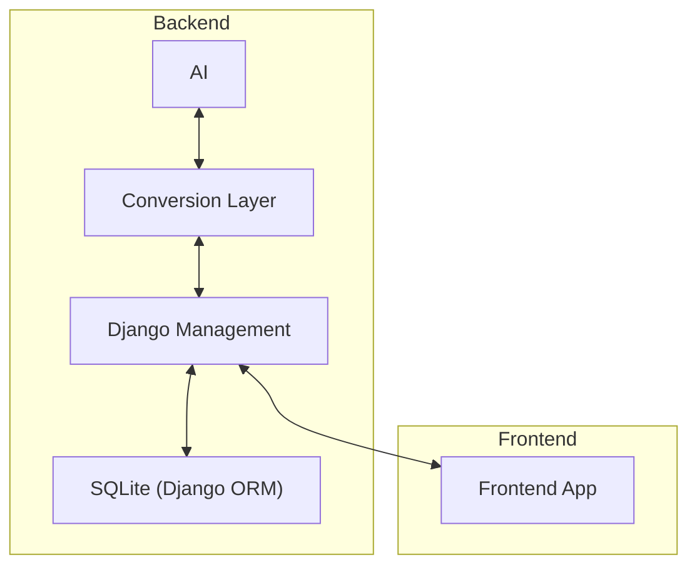

# REX (Requirement Extractor)

A requirement management tool with a requirement from text extraction.

## How to Run?

1. Clone the Repository
```bash
git clone 
```

2. Create a virtual enviroment and install the requirements
```bash
python -m venv .venv
.venv/bin/activate

pip install -r requirements.txt
```

3. Create a .env file and add the enviroment variables

4. Run the backend

  4.1. Go to the backend folder and run
```bash
python manage.py makemigrations
python manage.py migrate
python manage.py runserver
```

5. Run the frontend

  5.1 Go to the frontend folder and run
```bash
python streamlit app.py
```

## Archtecture
