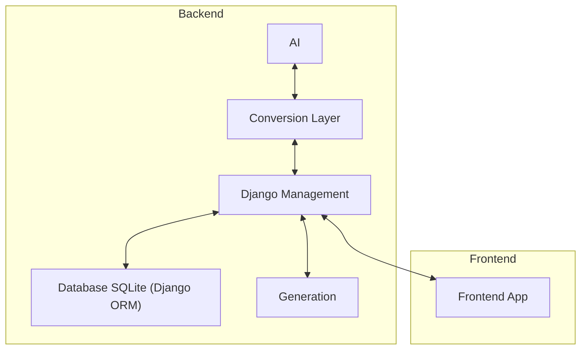

# REX Archtecture

## Management Layer
This layer is responsable for manipulating and retrieving the created models (explained at [models.md](models.md)). The Management Layer was created using the Django Framework and is divided in the following sublayers:
* **models**: Definition of the domain classes and their attributes; This layer is also used by the Django ORM (Object Relational Mapping) to define the database classes;
* **serializers**: Define the behaviour of the views and their relation with their respective models; and
* **views**: Define the views exposed in the Backend API.

## Database Layer
The database layer is a hidden layer that is created automatically by the Django Framework using the models of the models sublayer from the management layer. It is created in SQLite nad stores the created objects.

## AI Layer
This layer has the objective of using AI agents to create the respective models based on a given textual description of a information system. The AI layer uses LangChain and LangGraph to organize the agent's flow and the Gemini API to create the models. It is organized in the following layers:
* **models**: Recreation of the management layer models; And the definition of the response models used to standarize the AI output;
* **agents**: Definition of the agents and their inputs, prompts and output formats; and
* **graph**: Organization of the agents in invokable langgraph graphs;

## Conversion Layer
Utility layer that transforms the management layer models into the ai layer models and instanciates the ai layer models into mamagement layer models.

## Generation Layer
Layer that stores the functions for the supported generations (E.g.: Json). Their serializers are stored in the serializer sublayer at the management layer.

## Frontend Layer
The user interaction layer. Calls the Backend API routes.