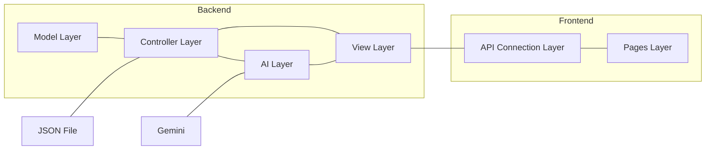

# REX Archtecture

```mermaid
flowchart LR

A[Gemini]
B[JSON File]

subgraph Backend
  C[Model Layer]
  D[Controller Layer]
  E[AI Layer]
  F[View Layer]
end

subgraph Frontend
  G[API Connection Layer]
  H[Pages Layer]
end

C --- D
D --- E
D --- F
E --- F
F --- G

A --- E
B --- D

G --- H
```

## Backend

### Model Layer
Defines all the models used in the system.

The models are divided in 4 groups: Domain Narrative, Requirements, Use Cases and Classes.

The models are better explained in [Models](./models.md).

### Controller Layer
Divided in 2 parts:
- Converter: Transforms given dictionaries in instances of the models.
- Generator: Reads from and writes in the JSON file.

### AI Layer
Instanciates models based on a user-given input and on already existent models.

### View Layer
Creates the API routes to access the backend.

## Frontend

## API Connection Layer
Creates functions to use the backend API.

## Pages Layer
Creates the pages accessed by the user.