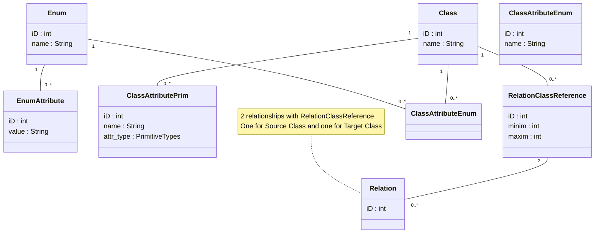
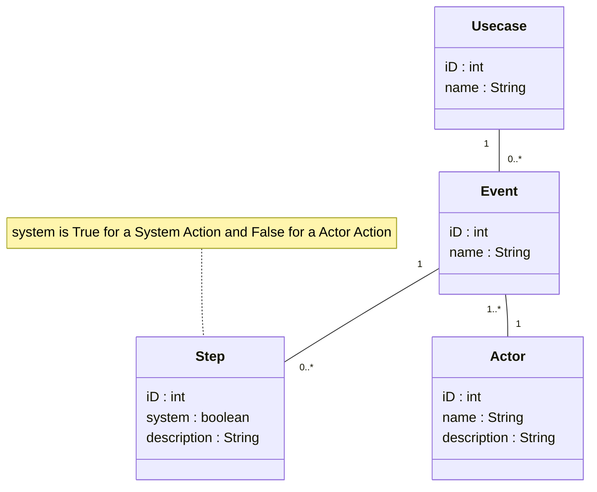

# REX Models

## Class Diagram

```mermaid
classDiagram

class Enum {
  iD : int
  name : String
}

class EnumAttribute {
  iD : int
  value : String
}

class Class {
  iD : int
  name : String
}

class ClassAttributePrim {
  iD : int
  name : String
  attr_type : PrimitiveTypes
}

class ClassAtributeEnum {
  iD : int
  name : String
}

class RelationClassReference {
  iD : int
  minim : int
  maxim : int
}

class Relation {
  iD : int
}

Enum "1" -- "0..*" EnumAttribute
Class "1" -- "0..*" ClassAttributePrim
Enum "1" -- "0..*" ClassAttributeEnum
Class "1" -- "0..*" ClassAttributeEnum
Class "1" -- "0..*" RelationClassReference
RelationClassReference "2" -- "0..*" Relation

note for Relation "2 relationships with RelationClassReference</br>One for Source Class and one for Target Class"
```

## Use Case Model

```mermaid
classDiagram

class Usecase {
  iD : int
  name : String
}

class Event {
  iD : int
  name : String
}

class Step {
  iD : int
  system : boolean
  description : String
}

class Actor {
  iD : int
  name : String
  description : String
}

Usecase "1" -- "0..*" Event
Event "1" -- "0..*" Step
Event "1..*" -- "1" Actor

note for Step "system is True for a System Action and False for a Actor Action"
```