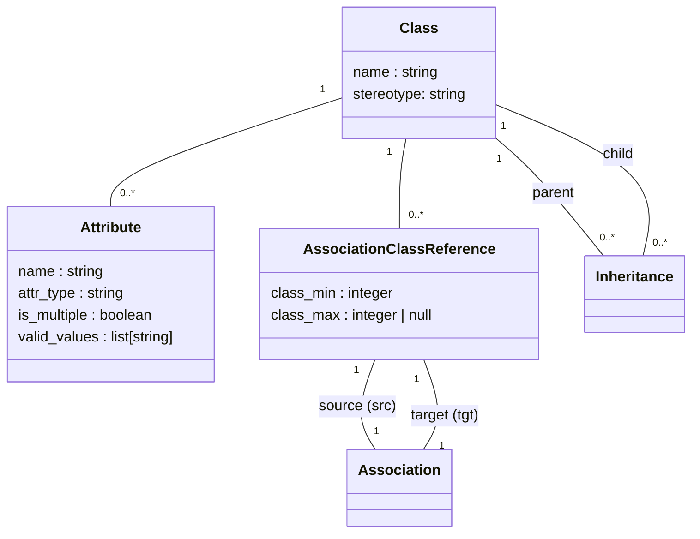
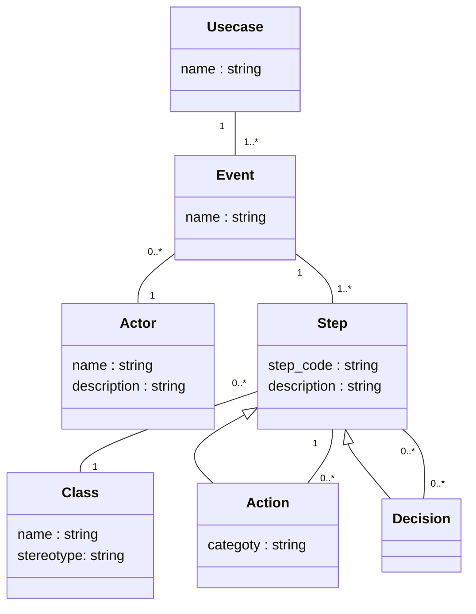

# REX Models

## Class Diagram Model

```mermaid
classDiagram

class Class {
  name : string
  stereotype: string
}

class Attribute {
  name : string
  attr_type : string
  is_multiple : boolean
  valid_values : list[string]
}

class Association

class AssociationClassReference {
  class_min : integer
  class_max : integer | null
}

class Inheritance

Class "1" -- "0..*" Attribute

Class "1" -- "0..*" AssociationClassReference

AssociationClassReference "1" -- "1" Association : source (src)
AssociationClassReference "1" -- "1" Association : target (tgt)

Class "1" -- "0..*" Inheritance : parent
Inheritance "0..*" -- "1" Class : child
```

## Use Case Model

```mermaid
classDiagram

class Usecase {
  name : string
}

class Event {
  name : string
}

class Actor {
  name : string
  description : string
}

class Step {
  step_code : string
  description : string
}

class Action {
  categoty : string
}

class Decision

class Class {
  name : string
  stereotype: string
}

Usecase "1" -- "1..*" Event

Event "1" -- "1..*" Step
Event "0..*" -- "1" Actor

Step "0..*" -- "1" Class

Action "0..*" -- "1" Step
Decision "0..*" -- "0..*" Step

Step <|-- Action
Step <|-- Decision
```