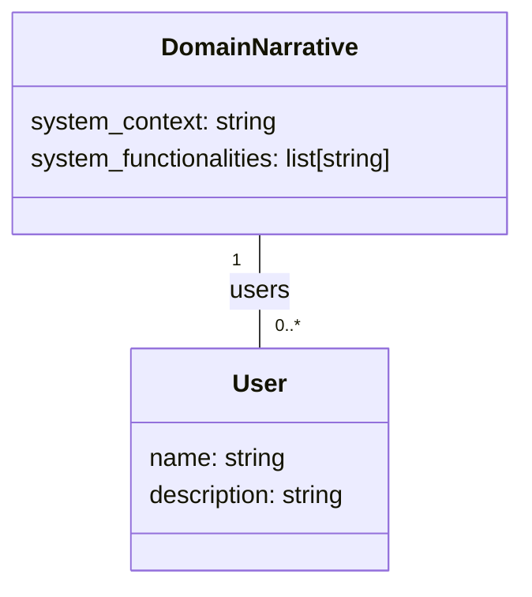
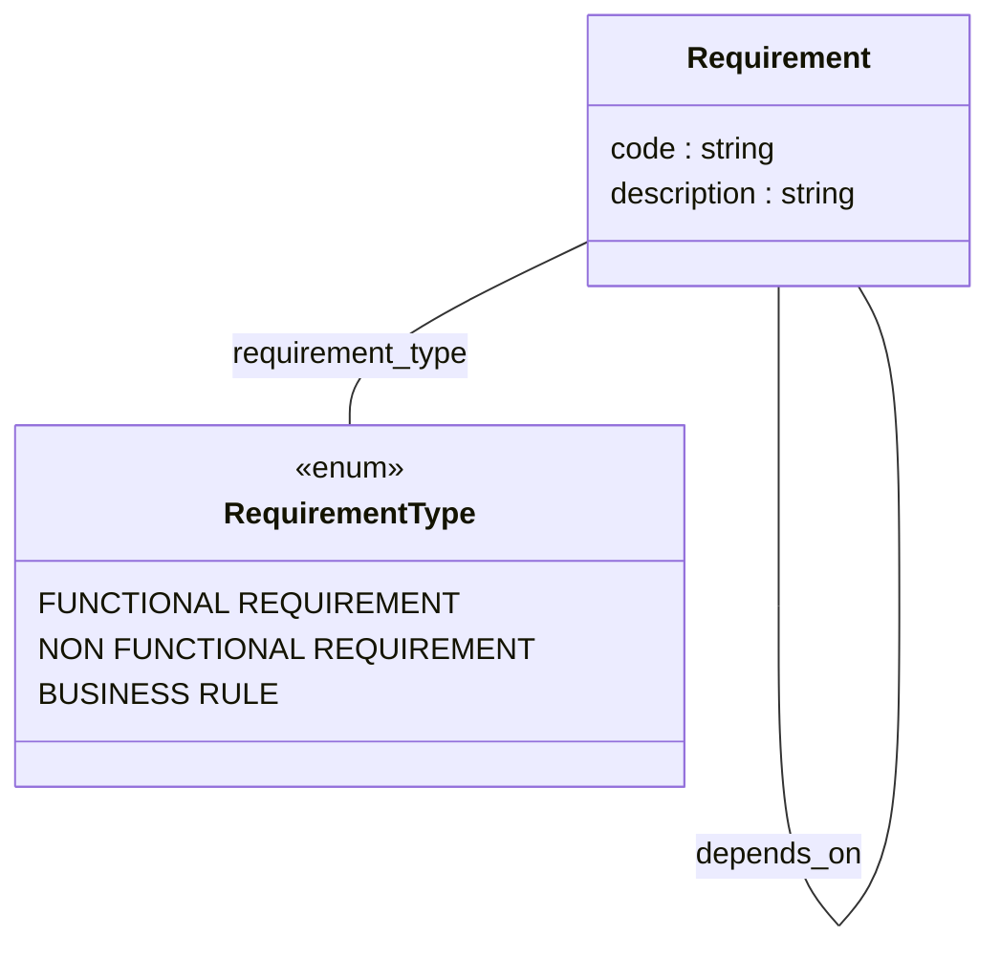
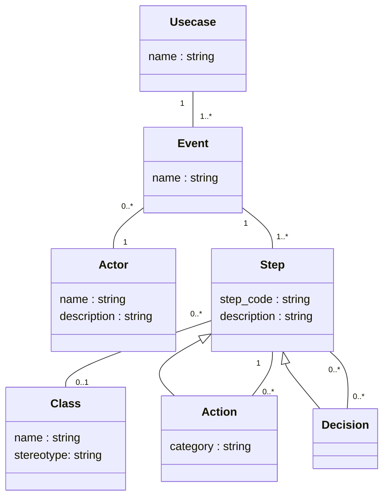
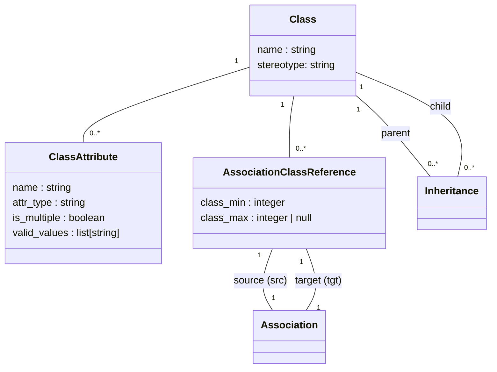

# REX Models

## Domain Narrative Models

The **domain narrative** is a textual description of the system that is divided in 3 parts:
- System context: The context of the domain that the system is/will be in;
- **Users**: The users of the system; and
- System functionalities: The functionalities of the system.

## Requirement Models

The requirements represents what is needed in the system. Each **requirement** is represented by a unique code and have a description. Also, requirements can have dependencies among them. Finally, all **requirements** are from one of the following types:
- Functional Requirement: Represents a funcionality of the system;
- Non Functional Requirement: Represents a limitation or a quality constraint of the system; and
- Business Rule: Represents a domain constraint or policy that the system must comply with.

## Use Case Models

The usecases are a more in detail description of the functionalities of the system. Each **usecase** have one or more **events**. Each **event** (traditionally called usecase) have a step by step description and the **actors** that executes the **steps**. Each **step** can be a **action** that can manipulate a **class** or be a **decision** to one or more other **steps**.

## Class Diagram Models

The class diagram is composed of classes, their associations and inheritances. Each **class** can have attributes. Each **atribute** have a name and a type, also a **atribute** can have a set of valid values (valid_values) and can have multiple values associated to it (is_multiple). The classes also have associations. The associations are defined by **association class reference** (ACR) and **association** objects. Each **association** have 2 **ACRs**, one as source of the association and other as target, and each **ACR** have a **class** associated and the min and max (with many(`*`) being represented by `null`) amount allowed of that **class** in the **association**. Finally, the **inheritances** have 2 classes associated, on being the parent, or superclass, in the inheritance and the other being the child, or subclass.
