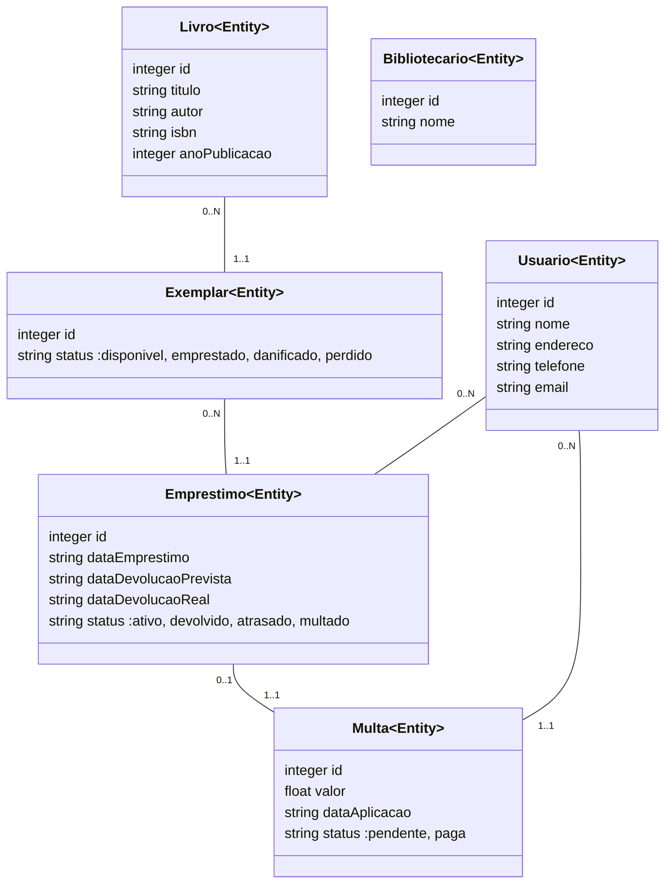

# Classes
## Livro <Entity>

### Attributes

* id: integer  
* titulo: string  
* autor: string  
* isbn: string  
* anoPublicacao: integer  

### Associations

* Livro "0..N" --> "1..1" Exemplar

### Inheritances

## Exemplar <Entity>

### Attributes

* id: integer  
* status: string  (valid values: disponivel, emprestado, danificado, perdido)

### Associations

* Livro "0..N" --> "1..1" Exemplar
* Exemplar "0..N" --> "1..1" Emprestimo

### Inheritances

## Usuario <Entity>

### Attributes

* id: integer  
* nome: string  
* endereco: string  
* telefone: string  
* email: string  

### Associations

* Usuario "0..N" --> "1..1" Emprestimo
* Usuario "0..N" --> "1..1" Multa

### Inheritances

## Bibliotecario <Entity>

### Attributes

* id: integer  
* nome: string  

### Associations

### Inheritances

## Emprestimo <Entity>

### Attributes

* id: integer  
* dataEmprestimo: string  
* dataDevolucaoPrevista: string  
* dataDevolucaoReal: string  
* status: string  (valid values: ativo, devolvido, atrasado, multado)

### Associations

* Usuario "0..N" --> "1..1" Emprestimo
* Exemplar "0..N" --> "1..1" Emprestimo
* Emprestimo "0..1" --> "1..1" Multa

### Inheritances

## Multa <Entity>

### Attributes

* id: integer  
* valor: float  
* dataAplicacao: string  
* status: string  (valid values: pendente, paga)

### Associations

* Emprestimo "0..1" --> "1..1" Multa
* Usuario "0..N" --> "1..1" Multa

### Inheritances

# Diagram

# Question
Como a regra de negócio 'A biblioteca deve ter, ao menos, 3 exemplares de todos os livros a todo momento, exceto pelos livros que a biblioteca possui menos de 3 exemplares.' (BR002) é monitorada e aplicada pelo sistema? Existe um evento específico para isso, ou é uma validação durante a adição/remoção de livros? ()

Quais eventos e atores são responsáveis pela criação, atualização e exclusão de Livros e Usuários no sistema, conforme descrito em FR008 e FR009? ()

O Bibliotecário é um tipo de Usuário com permissões adicionais ou é uma entidade completamente separada? (Bibliotecario; Usuario)

