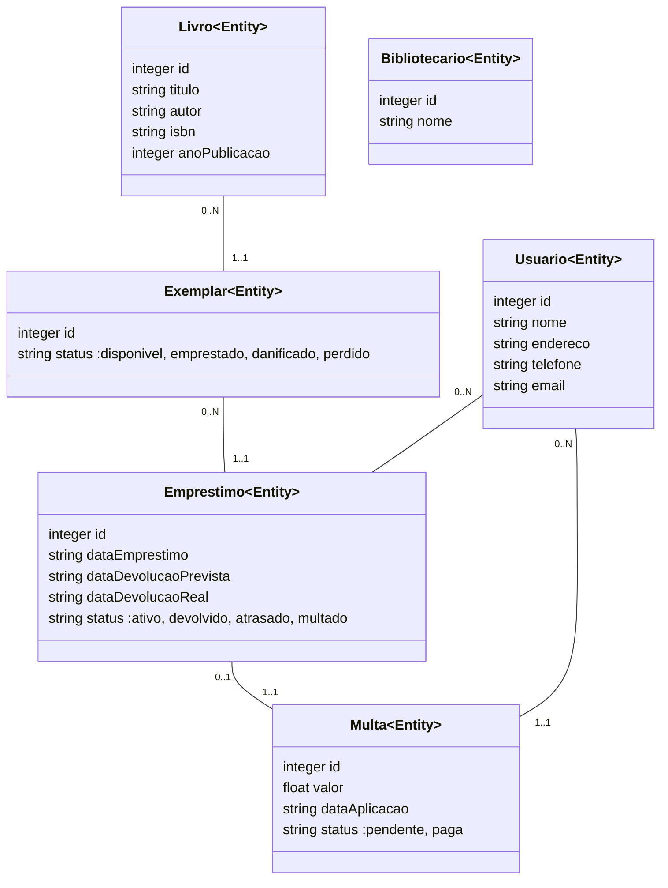

# Classes
## Livro <Entity>

Representa um título de livro no acervo da biblioteca.

### Attributes

* id: integer  (description: Identificador único do livro.) 
* titulo: string  (description: O título do livro.) 
* autor: string  (description: O autor do livro.) 
* isbn: string  (description: O International Standard Book Number do livro.) 
* anoPublicacao: integer  (description: O ano de publicação do livro.) 

### Associations

* Livro "0..N" --> "1..1" Exemplar

### Inheritances

## Exemplar <Entity>

Representa uma cópia física específica de um livro.

### Attributes

* id: integer  (description: Identificador único do exemplar.) 
* status: string  (description: O status atual do exemplar (disponível, emprestado, danificado, perdido).) (valid values: disponivel, emprestado, danificado, perdido)

### Associations

* Livro "0..N" --> "1..1" Exemplar
* Exemplar "0..N" --> "1..1" Emprestimo

### Inheritances

## Usuario <Entity>

Representa um usuário cadastrado na biblioteca que pode realizar empréstimos.

### Attributes

* id: integer  (description: Identificador único do usuário.) 
* nome: string  (description: O nome completo do usuário.) 
* endereco: string  (description: O endereço residencial do usuário.) 
* telefone: string  (description: O número de telefone do usuário.) 
* email: string  (description: O endereço de e-mail do usuário.) 

### Associations

* Usuario "0..N" --> "1..1" Emprestimo
* Usuario "0..N" --> "1..1" Multa

### Inheritances

## Bibliotecario <Entity>

Representa um funcionário da biblioteca com permissões administrativas.

### Attributes

* id: integer  (description: Identificador único do bibliotecário.) 
* nome: string  (description: O nome completo do bibliotecário.) 

### Associations

### Inheritances

## Emprestimo <Entity>

Representa um registro de empréstimo de um exemplar para um usuário.

### Attributes

* id: integer  (description: Identificador único do empréstimo.) 
* dataEmprestimo: string  (description: A data em que o exemplar foi emprestado.) 
* dataDevolucaoPrevista: string  (description: A data prevista para a devolução do exemplar.) 
* dataDevolucaoReal: string  (description: A data real em que o exemplar foi devolvido.) 
* status: string  (description: O status atual do empréstimo (ativo, devolvido, atrasado, multado).) (valid values: ativo, devolvido, atrasado, multado)

### Associations

* Usuario "0..N" --> "1..1" Emprestimo
* Exemplar "0..N" --> "1..1" Emprestimo
* Emprestimo "0..1" --> "1..1" Multa

### Inheritances

## Multa <Entity>

Representa uma multa aplicada a um usuário devido a atraso na devolução.

### Attributes

* id: integer  (description: Identificador único da multa.) 
* valor: float  (description: O valor monetário da multa.) 
* dataAplicacao: string  (description: A data em que a multa foi aplicada.) 
* status: string  (description: O status atual da multa (pendente, paga).) (valid values: pendente, paga)

### Associations

* Emprestimo "0..1" --> "1..1" Multa
* Usuario "0..N" --> "1..1" Multa

### Inheritances

# Diagram

```mermaid
classDiagram

class Livro~Entity~ {
integer id 
string titulo 
string autor 
string isbn 
integer anoPublicacao 
}

class Exemplar~Entity~ {
integer id 
string status :disponivel, emprestado, danificado, perdido
}

class Usuario~Entity~ {
integer id 
string nome 
string endereco 
string telefone 
string email 
}

class Bibliotecario~Entity~ {
integer id 
string nome 
}

class Emprestimo~Entity~ {
integer id 
string dataEmprestimo 
string dataDevolucaoPrevista 
string dataDevolucaoReal 
string status :ativo, devolvido, atrasado, multado
}

class Multa~Entity~ {
integer id 
float valor 
string dataAplicacao 
string status :pendente, paga
}

Livro "0..N" -- "1..1" Exemplar
Usuario "0..N" -- "1..1" Emprestimo
Exemplar "0..N" -- "1..1" Emprestimo
Emprestimo "0..1" -- "1..1" Multa
Usuario "0..N" -- "1..1" Multa

```

# Question
Como a regra de negócio 'A biblioteca deve ter, ao menos, 3 exemplares de todos os livros a todo momento, exceto pelos livros que a biblioteca possui menos de 3 exemplares.' (BR002) é monitorada e aplicada pelo sistema? Existe um evento específico para isso, ou é uma validação durante a adição/remoção de livros? ()

Quais eventos e atores são responsáveis pela criação, atualização e exclusão de Livros e Usuários no sistema, conforme descrito em FR008 e FR009? ()

O Bibliotecário é um tipo de Usuário com permissões adicionais ou é uma entidade completamente separada? (Bibliotecario; Usuario)

